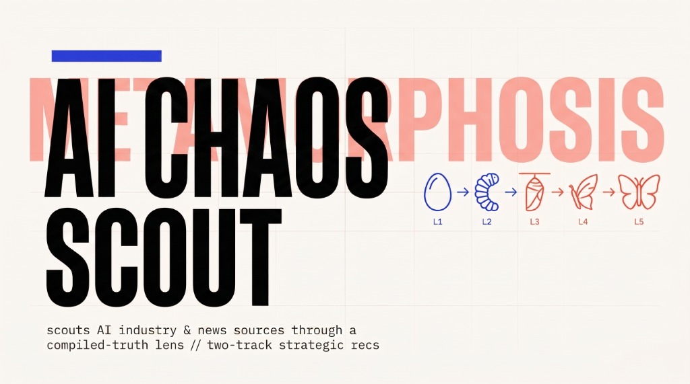
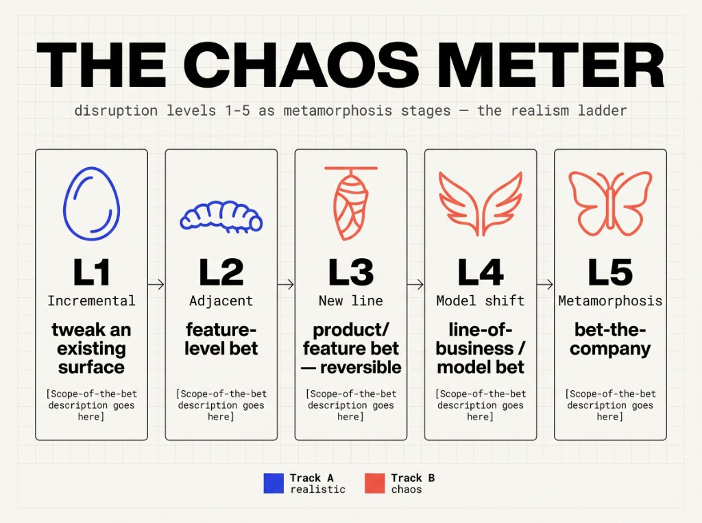

# AI Chaos Scout



**Point it at a company once. Then, per run, one command: it re-reads what the company
IS, reads the AI industry *as that company*, and hands back an email + deck — realistic moves
and metamorphosis-level chaos plays, every idea with receipts, ready to forward.**

This is **a repo, not a service.** Open it in an agentic IDE (Devin, Cursor, Claude
Code, Copilot, Gemini CLI) and the resident agent becomes a weekly "chaos briefing"
analyst. No backend, no database, **no API keys in the core path** — all memory lives
in repo files.

> ⚠️ Hackathon build ("Agents of Chaos"). The full pipeline runs end-to-end — see a real
> generated run for **Twenty** (the open-source CRM) under `runs/` and `docs/example-run/`.
> See `AGENTS.md` for the operating manual.

---

## Key Features

- **Lens-first** — reads what the company *is* before scanning the industry, so every finding is scoped to that company, not generic AI news.
- **Two-track recommendations** — realistic moves *and* metamorphosis-level "chaos" plays, each scored on four 1–5 sliders (feasibility, evidence, impact, disruption).
- **Living memory** — a cited compiled-truth summary plus an append-only timeline; drop in new material and it *diffs and re-ranks*, never rebuilds. The repo is the memory.
- **Grounded by design** — every recommendation cites a real trend (*why-now*) and a real company fact (*why-us*), behind a self-check gate. No uncited claims.
- **Efficient, incremental runs** — ETag conditional fetches + a seen-cache + a recency window; each run only processes what's *new*, and re-running weekly just catches up.
- **Keyless & portable** — no database, no API keys in the core path; runs in any agentic IDE (Devin, Cursor, Claude Code, Copilot, Gemini CLI).
- **Outlook-ready delivery** — emits `.md` + `.html` + a double-click `.eml` draft (nothing auto-sends); optional Composio Gmail draft.
- **Enterprise-extensible** — Tier-1 adapters (X, Reddit, SharePoint, Greptile) scaffolded behind one interface; turning one on is config, not a rebuild.
- **Fails honestly** — blocked sources are skipped and named in a provenance block; a zero-novelty run says so instead of padding.

---

## Setup (~5 minutes)

**Requirements:** Python 3.10+ on PATH; an agentic IDE with terminal + web tools;
outbound HTTPS (443) to ~10 public source domains. That's it — no keys required.

1. `git clone https://github.com/situhacks/ai-chaos-scout.git` and open the folder in
   your IDE.
   - Cursor auto-loads `.cursor/rules/chaos-scout.mdc`; Claude Code reads `CLAUDE.md`
     (which imports `AGENTS.md`); every other agent reads `AGENTS.md` directly.
2. Edit **`config/subject.yaml`** — paste the target company's URL and/or a public
   GitHub repo (and/or point `folder:` at a local docs directory). *This is unset by
   default; set it before the first run.*
3. *(Optional)* Connect **Composio** for Gmail-draft delivery — see `docs/composio.md`.
   Skippable; everything below works without it.

## Run it

In the agent panel:

- **`/chaos-run`** — the whole pipeline (this is the demo command).

Or run the stages individually:

- **`/chaos-lens`** (Stage 1) — ingest the subject → `knowledge/project-summary.md`
  (compiled-truth + timeline) and `knowledge/lens.md` (the research lens).
- **`/chaos-scout`** (Stage 2) — `python scout/run_scout.py` polls the keyless sources
  *through the lens* → `runs/{date}/items.jsonl`; the agent tags + writes `digest.md`.
- **`/chaos-report`** (Stage 3) — cross digest × company truth → two tracks of grounded
  recommendations → `reports/chaos-report-{date}.md` + `.html` + `.eml`.

**Output:** deliverables in `reports/`:
- **`.eml`** — double-click to open in Outlook/mail client as a ready-to-send draft (nothing auto-sends)
- **`.html`** — standalone Riso Field-Study render
- **`.md`** — paste-anywhere email body
- **`.pptx`** + **`.pdf`** — full presentation deck (run `python tools/build_deck.py --input runs/{date}/report.json`)

## What good looks like

3–5 realistic recommendations + 2–3 metamorphosis plays, each citing a real trend
(**Why now**) AND a real fact about the company (**Why us**), with four 1–5 sliders
(feasibility, evidence, impact, disruption). Drop a new doc into `subject/` and run
again: the timeline appends, the compiled-truth header refreshes, and recommendations
re-rank — the repo is the living memory.

### The Chaos Meter



## How it works

```
Stage 1 /chaos-lens      Stage 2 /chaos-scout        Stage 3 /chaos-report
subject material    ->   lens drives keyless    ->   digest × compiled truth
-> project-summary.md    source polling ->           -> scored recommendations
-> lens.md               digest.md                   -> .md / .html / .eml report
```

**Scripts fetch, the agent judges.** Deterministic mechanics (fetch, parse, dedup,
state, render) live in `scout/` (Python pipeline); all judgment (summarize, distill
the lens, tag relevance, recommend) lives in the agent. The product cannot exist
non-agentically.

### Sources (Tier 2 — keyless, the working path)
RSS blogs (OpenAI, Hugging Face, Google AI, arXiv cs.AI, MarkTechPost) · GitHub
releases (unauth + ETag) · GitHub Trending (best-effort) · Hacker News (Algolia,
lens-driven queries) · OSSInsight trending repos · Reddit RSS · YouTube channel feeds.
Every fetch is conditional (ETag) and soft-fails independently — a blocked source is
skipped and named in the report's Provenance, never fatal.

### Tier 1 — keyed/paid adapters (UNTESTED scaffolds, `enabled: false`)
`scout/adapters/` holds `x_api`, `reddit_oauth`, `greptile`, `msgraph_sharepoint` — they
share one `SourceAdapter` interface and prove the architecture extends to the enterprise
version, but are **never exercised** in the core path (turning one on is config, not a
rebuild). They raise `AdapterNotConfigured` when their env vars are unset.

## Deployment assumptions

- Agentic IDE seat with Agent + terminal enabled; outbound HTTPS to the source domains.
- Python 3.10+ on PATH; (install requirements via `pip install -r requirements.txt`).
- `.cursor/` writable at install/commit time (enterprise may lock it afterward — humans
  commit, the agent reads).
- GitHub unauth budget (60 req/hr) is shared per egress IP — the ETag discipline exists
  for this. A blocked source degrades gracefully (scripts → agent web tool → manual paste).

## Repo layout

See `AGENTS.md` for the full state-file map. Key directories: `config/` (subject +
sources), `knowledge/` (compiled-truth summary + lens), `scout/` (data pipeline +
adapters + templates), `state/` (seen/etags/last-run), `runs/{date}/` (per-run work),
`reports/` (deliverables), `docs/` (rubric, design language, Composio).

## Not in scope

Real scheduling (narrated as "weekly", demoed by running twice) · *sending* email (drafts
only) · live SharePoint beyond the scaffold.

## License

MIT — see `LICENSE`.
